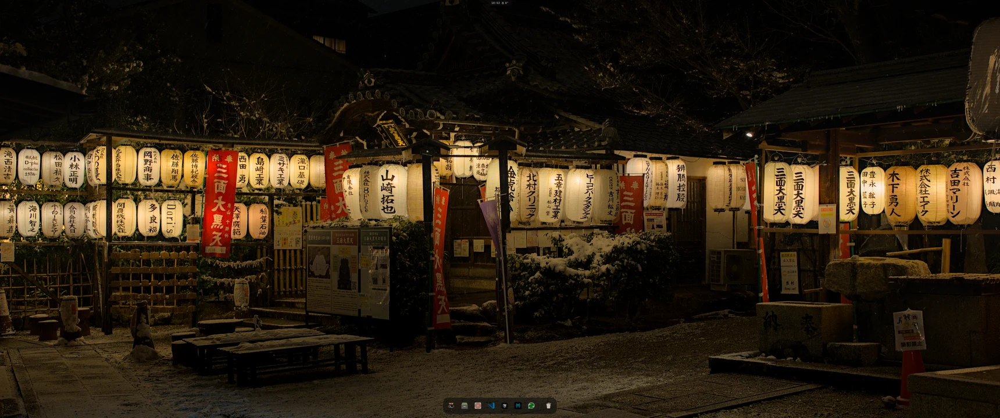
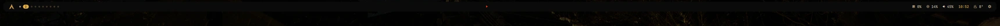
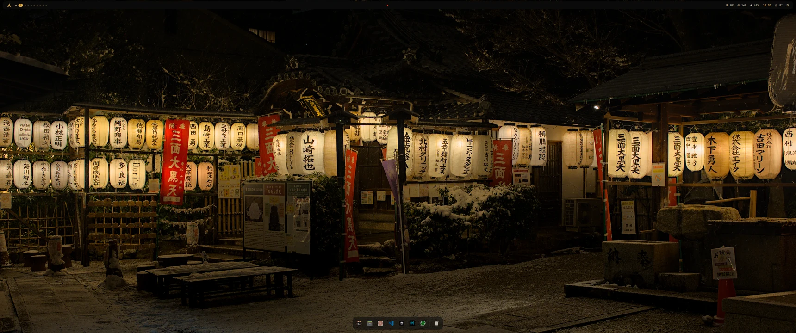
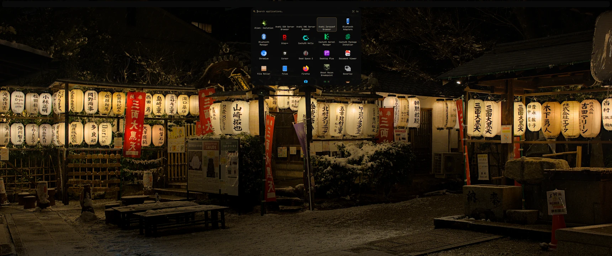

<div align="center">

# PraXe

**Um rice de Hyprland que se reconstrói inteiro a partir de uma paleta.**

Sete temas, uma barra em Quickshell, tela de bloqueio, dock, lançador e
trinta e oito utilitários, todos lendo as mesmas dez cores.


</div>

<div align="center">



<sub>Tema **Samurai** · a cápsula flutuante recolhida no topo</sub>

</div>

---

## Dois formatos, a mesma configuração

A peça do topo tem dois modos, trocáveis em `pill.json` sem reiniciar nada.

**Cápsula**: flutua no centro, encolhe num filete quando não está em uso e
abre como uma gota que desce do recorte. Some do caminho.


**Barra**: de ponta a ponta, altura fixa, nunca encolhe. As dez áreas
sempre à vista, e o painel abre como menu ancorado ao botão que o chamou,
em vez de a barra virar painel.



<div align="center">



</div>

<div align="center">



<sub>O lançador de aplicativos, com busca incremental</sub>

</div>

---

## Instalação

```bash
git clone https://github.com/sidnei-almeida/hypr-dots.git ~/Documents/GitHub/hypr-dots
cd ~/Documents/GitHub/hypr-dots
./install.sh
```

Antes de confiar, veja o que ele faria sem tocar em nada:

```bash
./install.sh --seco
```

| Argumento | Efeito |
|---|---|
| `--seco` | Mostra cada comando, não executa nenhum |
| `--sem-pacotes` | Só as configurações, nada de `pacman` |
| `--sem-papeis` | Não copia os 40 papéis de parede |

O que existia antes **nunca é sobrescrito em silêncio**: tudo vai para
`~/.config/praxe-backup-<data>/` antes de qualquer ligação. E o script é
idempotente: rodar duas vezes seguidas não estraga o que fez na primeira.

---

## Duas decisões que explicam o resto

### 1. O repositório *é* a configuração viva

`~/.config/hypr` e `~/.config/rice` viram **ligações simbólicas** para
`config/` daqui. Não há cópia, e por isso não há o passo de "copiar de
volta para o repo" que ninguém lembra de fazer, que é exatamente o passo
esquecido que transforma dotfiles em museu.

Editou hoje, está versionado agora.

> Papéis de parede e atalhos `.desktop` são a exceção: vão como cópia.
> São dados que você mexe por fora (baixa um papel, o Steam escreve um
> atalho), e ligar a pasta faria o repositório crescer sem você pedir.

### 2. Aqui mora fonte, nunca artefato gerado

O `rice-theme` **escreve catorze arquivos** a cada troca de tema:

```
hyprlock.conf · colors.lua · decor.lua · opacity.lua · hyprpaper.conf
fuzzel.ini · kitty/colors.conf · gtk-3.0/gtk.css · gtk-4.0/gtk.css
gtk-*/settings.ini · kdeglobals · fastfetch/config.jsonc · mpv.conf · imv/config
```

Nenhum deles está no repositório, e é de propósito: versionar saída de
gerador é garantir um diff sujo em toda troca de tema, e um `git pull` que
traz a paleta de outra máquina por cima da sua.

**Consequência prática:** logo depois de clonar, a máquina tem os
geradores mas não a saída deles. Por isso o último passo do `install.sh` é
rodar `rice-theme set`, e a instalação não está completa sem ele.

---

## O que tem dentro

```
hypr-dots/
├── install.sh              instalação numa máquina limpa
├── config/
│   ├── hypr/               Hyprland em Lua, hypridle, 7 shaders de tela
│   ├── rice/
│   │   ├── themes/         paletas, uma por arquivo, fábrica e derivadas
│   │   ├── shell/          a barra em Quickshell (20 arquivos, 7.9k linhas)
│   │   ├── idioma/         pt · en · es
│   │   └── assets/
│   ├── kitty/
│   └── Code/User/          settings e keybindings do VSCode
├── bin/                    38 utilitários rice-*
├── wallpapers/             40 imagens
├── apps/applications/      atalhos .desktop
└── packages/               pacman · AUR · dev · extensões do VSCode
```

### Por que `packages/dev.txt` existe separado

`pacman.txt` é gerado por `pacman -Qqen`, que lista apenas os pacotes
**explícitos**. O `nodejs` e o `npm` desta máquina entraram como
*dependência* de outro pacote, então não apareciam ali, e numa instalação
nova só existiriam se algum outro pacote os puxasse por acaso.

É uma falha silenciosa: no dia em que a árvore de dependências mudar, a
máquina nova sobe sem Node e a lista continua parecendo completa.
`dev.txt` registra a **intenção** (`nodejs`, `npm`, `typescript`) em vez do
efeito colateral.

> O TypeScript vem do repositório do Arch, não de `npm i -g`. O prefixo do
> npm aqui é `/usr`, então todo global exigiria `sudo` e escreveria dentro
> do território do pacman. Se precisar de globais do npm, mude o prefixo
> antes: `npm config set prefix "$HOME/.local"`.

### O Hyprland é configurado em **Lua**, não em hyprlang

Não existe `hyprland.conf`. O ponto de entrada é `hyprland.lua`, que dá
`require` nos módulos. Isso muda o `hyprctl dispatch`, e a forma clássica
falha:

```bash
hyprctl dispatch workspace 3                    # ✗ erro de sintaxe Lua
hyprctl dispatch "hl.dsp.focus({ workspace = 3 })"   # ✓
```

---

## Temas

**Sete de fábrica:** `Catppuccin Mocha` · `Everforest Dark` ·
`Gruvbox Dark` · `Hotrod` · `Maré` · `Nord` · `Samurai`

**Mais os derivados de papel de parede**, criados pelo `rice-auto` e
marcados com `PROPRIO=sim`, e é essa marca que permite ao `rice-cores`
apagá-los e que impede um tema de fábrica de ser destruído por engano.

Cada tema é um arquivo com dez cores, a cor de pasta do Papirus e um papel
de parede:

```bash
BG · BG_ALT · FG · MUTED · DIM · ACCENT · ACCENT2 · OK · WARN · ERR
PASTAS · WALLPAPER · NAME
```

Nenhuma cor é inventada: sai da imagem do papel de parede ou de uma paleta
oficial, e a escolha se justifica por **ΔE em CIELAB**. Não há campo de
borda: nenhum tema pode desenhar contorno em nada, e isso é regra de
identidade, não omissão.

```bash
rice-theme menu          # escolher pela interface
rice-theme set nord      # direto
rice-theme current       # qual está em uso
rice-cores               # clonar e editar cor a cor
```

### Tema derivado do papel de parede

```bash
rice-auto                          # gera a partir do papel em vigor
rice-auto --mostrar <imagem>       # só mostra a paleta, não grava
rice-auto --aplicar <imagem>       # gera e passa a usar
```

No seletor de papel de parede há um interruptor que decide o que o
próximo clique numa imagem faz:

| interruptor | efeito |
|---|---|
| **desligado** (padrão) | troca só o papel. O tema em vigor fica intacto |
| **ligado** | deriva a paleta da imagem, cria um tema do usuário e aplica |

Ele fica ali, e não no painel de aparência, porque a decisão é sobre o que
o *próximo clique* faz, e precisa estar à vista no momento da escolha. O
estado persiste no `pill.json` (`autoTema`).

#### Trocar papel e trocar tema são operações diferentes

Um tema declara `WALLPAPER=`, e aplicá-lo troca a imagem, que é o que se
espera dele. Mas o seletor de papel de parede precisa **reaplicar o tema**
depois de trocar a imagem, porque o caminho do papel fica gravado dentro
do `hyprlock.conf` e sem isso a tela de bloqueio continuaria com a imagem
antiga.

As duas coisas se atropelavam: a reaplicação reescrevia o `hyprpaper.conf`
com o papel *do tema*, e a imagem recém-escolhida voltava atrás um quadro
depois, em silêncio. Era impossível trocar de papel.

```bash
RICE_SEM_PAPEL=1 rice-theme set <tema>   # regera tudo, menos a imagem
```

A variável vale para **uma chamada**. Ligar `papelFixo` no `pill.json`
resolveria o sintoma e criaria outro: aí trocar de *tema* deixaria de
trocar o papel.

#### Por que isto não fica feio

Extrair cor é a parte fácil. O que estraga auto-theming é deixar o
**contraste ao acaso**: a imagem decide tudo e metade das fotos produz
texto ilegível. Aqui as responsabilidades são separadas:

| decide | o quê |
|---|---|
| a imagem | **matiz** e **croma**, qual família de cor, quão viva |
| a tabela | **luminosidade**, fixa, por papel, em OKLab |

Como OKLab é perceptualmente uniforme, fixar `BG` em `L=0.16` e `FG` em
`L=0.92` dá **~15:1 de contraste com qualquer imagem do mundo**. Medido em
três papéis muito diferentes (lanternas japonesas, lua nórdica e um
hot rod), o contraste FG/BG deu `15.3:1` nos três.

Três regras que vieram de comparar o resultado com os temas feitos à mão:

- **Fundo e acento saem de lugares diferentes da foto.** O `hotrod.sh`
  anota, na própria linha, que o `BG` é *"o preto do pneu, frio"* e o
  `ACCENT` é *"ouro do bico, do capacete e dos raios"*. Fundo frio, acento
  quente, na mesma imagem. Um matiz só apagaria essa tensão.
- **O acento vem da cauda da distribuição, não da massa.** K-means por
  área sempre engole o reflexo pequeno e vivo. Medindo o hot rod: 46% da
  foto já está no matiz do ouro, e o ouro que o tema usou tem croma
  `0.132`, presente só no 1% superior. Por isso o corte é no **p97**.
- **`OK`, `WARN` e `ERR` mantêm o matiz semântico.** Verde que vira azul
  deixa de dizer "ok". Da imagem eles pegam só o croma.

A cor de pasta do Papirus é escolhida lendo o `fill:` dos SVGs do próprio
tema de ícones e pegando a de menor ΔE contra o acento. Se o Papirus
ganhar uma cor nova, ela entra sozinha.

> **Limite honesto:** quando a imagem tem vários destaques vivos, o
> gerador escolhe um deles e nem sempre é o que uma pessoa escolheria. No
> hot rod ele pega o vermelho da lataria em vez do ouro do capacete,
> ambos defensáveis. Ajuste depois com `rice-cores set ACCENT <hex>`.

---

## Comandos do dia a dia

| Comando | O que faz |
|---|---|
| `rice-theme` | Troca de tema e regera os catorze arquivos |
| `rice-cores` | Clona, renomeia e edita cor a cor os temas do usuário |
| `rice-auto` | Deriva um tema inteiro de uma imagem, em OKLab |
| `rice-anim` | Ritmo, quique (ζ) e estilo das animações |
| `rice-wallpaper` | Troca o papel de parede e reaplica o tema em vigor |
| `rice-keyring` | Faz o desbloqueio da tela destravar o cofre de senhas |
| `rice-vivido` | Realce de cor por shader, na tela inteira |
| `rice-icons` · `rice-folders` | Tema de ícones e cor das pastas |
| `rice-screenshot` · `rice-record` · `rice-ocr` | Captura, gravação e texto de imagem |
| `rice-keybindings` | Lista todos os atalhos |

### Animações

As curvas são **molas** (`type = "spring"`), não bezier, o mesmo modelo do
`spring(response:dampingFraction:)` do SwiftUI. A diferença que se sente:
quando o alvo muda no meio do caminho, a mola preserva a velocidade atual
em vez de reiniciar do zero.

```bash
rice-anim ritmo 0.8      # 20% mais rápido, a família inteira
rice-anim quique 0.85    # menos overshoot (1.0 = nenhum)
rice-anim estilo genio   # mola · cortina · deslize · genio
```

Rigidez e atrito nunca são digitados à mão: saem do período `T` e do
amortecimento `ζ`, calculados no `looknfeel.lua`.

---

## Tela de bloqueio

Fundo é o **papel de parede**, nunca `path = screenshot`: screenshot
congela o que estava na tela no instante do bloqueio, inclusive conversa e
e-mail à mostra. Borrar ajuda pouco: o layout continua reconhecível.

### O bloqueio não pode congelar a tela

O `loginctl lock-session` tranca a sessão **na hora**, e a tela fica no
último quadro até o hyprlock conseguir desenhar. Todo trabalho que ele faz
antes do primeiro quadro é tempo de tela travada, sem nenhum sinal.

Medido nesta máquina, só o custo de decodificar a imagem:

| origem | tamanho | decode |
|---|---|---|
| papel original (PNG 5160×2159) | 16,4 MB | **314 ms** |
| cache JPEG na resolução da tela | 1,8 MB | 60 ms |
| **cache a 1/4 da resolução** | **133 kB** | **8 ms** |

O cache é gerado pelo `rice-theme` e vive em `~/.cache/rice/`. É **1/4 da
resolução** porque o hyprlock passa três blurs por cima: guardar detalhe
na origem é trabalho para jogar fora em seguida.

Não é chute. Comparando em CIELAB a origem cheia borrada contra a origem
a 1/4 ampliada e borrada igual: **ΔE médio 0,21 · p95 0,76 · máximo 2,20**,
com o limiar de percepção em ~2,3. O pior pixel da imagem está no limite do
que o olho distingue.

Mais `immediate_render = true`, que desenha o fundo sem esperar os recursos
carregarem: segurar o primeiro quadro com a sessão já trancada é
exatamente o que se lê como "travou".

> O cache é validado pela **origem** (caminho + tamanho + data do arquivo),
> não por data de arquivo. Papel de parede é imagem baixada: a data dela é
> de quando foi salva no disco, e qualquer cache gerado depois seria "mais
> novo" que todos os papéis, e trocar de tema não regeraria nada e o
> bloqueio ficaria preso na imagem antiga.

---

## Depois de instalar

**1. O cofre de senhas.** Esta máquina entra por autologin, e login sem
senha significa que o PAM não tem o que repassar ao gnome-keyring no boot,
e cada aplicativo passa o dia pedindo a senha do cofre por conta própria. A
única autenticação real do dia é a tela de bloqueio, então é ela que
destrava:

```bash
rice-keyring     # diz o que falta e imprime o comando com sudo
```

**2. Entrar na sessão do Hyprland.** A sessão em execução não conhece nada
do que acabou de ser ligado.

---

## Requisitos

Arch Linux (ou derivado) com `pacman`. O `install.sh` cuida de 156 pacotes
oficiais e 8 do AUR. Para estes últimos é preciso ter o `paru`:

```bash
sudo pacman -S --needed base-devel git
git clone https://aur.archlinux.org/paru.git && cd paru && makepkg -si
```

Sem `paru`, o script avisa e segue: nada aqui depende do AUR para subir.

---

## Convenções do código

Todo arquivo é comentado **em português**, e o comentário explica o
**porquê** da decisão (e o que estava errado antes) em vez de descrever o
que o código faz. Comentário que narra a linha abaixo dele envelhece junto
com ela; comentário que guarda o motivo sobrevive à reescrita.

Há armadilhas documentadas no próprio código que custaram sessões inteiras
para achar. Duas que valem ser lidas antes de mexer:

- **`Dock.qml`**: por que o model de um `Repeater` é lista de *strings* e
  nunca de objetos. Guardar `Toplevel*` num mapa derruba o Quickshell com
  SIGSEGV: o delegate é *incubado*, e o ponteiro pode morrer no intervalo.
- **`rice-keyring`**: por que a linha do PAM é uma só, de `auth`. O
  hyprlock chama apenas `pam_authenticate()`; qualquer linha `session`
  naquele arquivo nunca executa.

---

<div align="center">
<sub>MIT · feito para uma tela de 3440×1440</sub>
</div>
